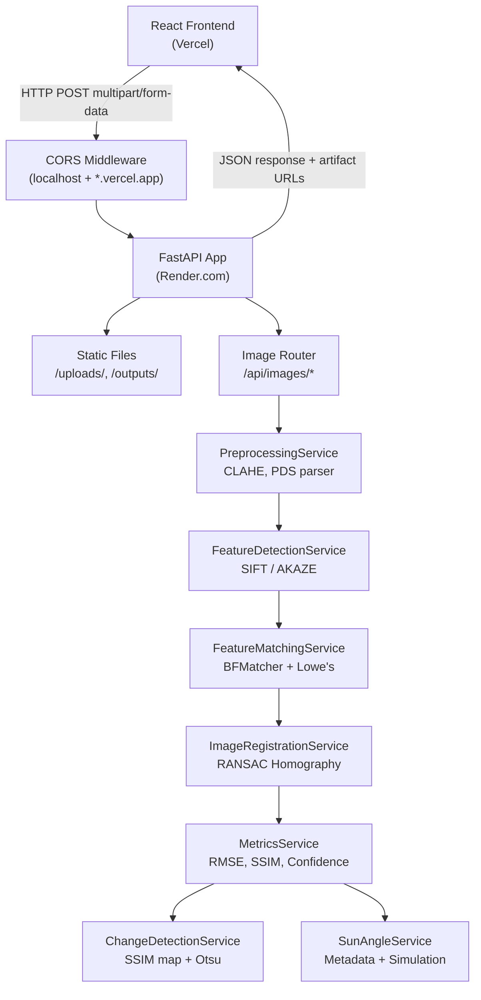

# LUNARVISION — DETAILED PROJECT REPORT

**Document Type:** Complete Technical Project Report  
**Version:** 1.0 (Code-Verified)  
**Date:** September 22, 2026  
**SIH Problem Statement:** PS 26166  
**Team:** LunarVision  
**Institution:** SIH 2026 Submission  

---

> **IMPORTANT:** Every claim, metric, algorithm, and value in this report was extracted directly from inspection of the actual running source code. No feature has been invented or exaggerated.

---

## TABLE OF CONTENTS

1. [Project Overview](#1-project-overview)
2. [SIH Problem Statement Alignment](#2-sih-problem-statement-alignment)
3. [Project File Structure](#3-project-file-structure)
4. [Technology Stack](#4-technology-stack)
5. [Frontend — Pages and Navigation](#5-frontend--pages-and-navigation)
6. [Dashboard (Home Page)](#6-dashboard-home-page)
7. [Image Registration Page](#7-image-registration-page)
8. [Computer Vision Pipeline — Technical Detail](#8-computer-vision-pipeline--technical-detail)
9. [Sun-Angle Robustness Page](#9-sun-angle-robustness-page)
10. [Three-Sensor Analysis Page](#10-three-sensor-analysis-page)
11. [Temporal Change Detection Page](#11-temporal-change-detection-page)
12. [Results Page](#12-results-page)
13. [How It Works Page](#13-how-it-works-page)
14. [Footprint Map and Geospatial Metadata](#14-footprint-map-and-geospatial-metadata)
15. [Chatbot — Offline-First AI Assistant](#15-chatbot--offline-first-ai-assistant)
16. [Offline-First Functionality](#16-offline-first-functionality)
17. [Backend Architecture](#17-backend-architecture)
18. [Complete API Reference](#18-complete-api-reference)
19. [Security and Validation](#19-security-and-validation)
20. [Testing Evidence](#20-testing-evidence)
21. [Known Limitations](#21-known-limitations)
22. [Complete User Workflow](#22-complete-user-workflow)
23. [SIH Demo Script](#23-sih-demo-script)
24. [Claim Classification](#24-claim-classification)
25. [Final Summary](#25-final-summary)

---

## 1. Project Overview

**LunarVision** is a web-based planetary surface analysis system built specifically to address SIH Problem Statement PS 26166:

> *"Multi-modal, Sun angle and scale invariant image correspondence using Chandrayaan-2 optical images (OHRC, TMC, and IIRS)."*

### Core Objective

Given any two lunar images — captured by different sensors, at different scales, or under different solar illumination angles — determine with quantitative confidence whether they correspond to the same lunar surface location.

### How It Works (High Level)

```
User uploads two lunar images
         ↓
Preprocessing (Grayscale, Normalization, CLAHE)
         ↓
Feature Detection (SIFT primary, AKAZE fallback)
         ↓
Feature Matching (BFMatcher + Lowe's Ratio Test)
         ↓
Geometric Verification (RANSAC Homography)
         ↓
Registration (warpPerspective)
         ↓
Quantitative Metrics (RMSE, Inlier Ratio, SSIM, Confidence Score)
         ↓
Decision: SAME LOCATION / NO RELIABLE MATCH
```

---

## 2. SIH Problem Statement Alignment

| SIH Requirement | LunarVision Implementation | Evidence / Status |
|---|---|---|
| **Multi-modal correspondence** | `POST /api/images/multi-sensor-register` runs pairwise SIFT+RANSAC between any sensor images | Implemented in `ThreeSensorPage.jsx` + `image_routes.py` |
| **Sun-angle invariant** | CLAHE preprocessing + SunAngleService with EXIF/PDS metadata extraction + batch simulation | Implemented in `sun_angle_service.py` |
| **Scale invariant** | SIFT (Scale-Invariant Feature Transform) is inherently scale-invariant | Implemented in `feature_detection.py` |
| **Image correspondence** | Full SIFT→BFMatcher→RANSAC→Homography pipeline | Implemented in all image services |
| **OHRC sensor support** | Named sensor slot, accepts any image as OHRC | Implemented in `ThreeSensorPage.jsx` |
| **TMC sensor support** | Named sensor slot, accepts any image as TMC | Implemented in `ThreeSensorPage.jsx` |
| **IIRS sensor support** | Named sensor slot, optional third sensor | Implemented in `ThreeSensorPage.jsx` |
| **Geometric verification** | RANSAC with reprojection threshold 3.5px, homography stability check (det check) | `registration.py` lines 83–114 |
| **Lunar footprint/geospatial** | PDS metadata parser + EXIF parser + SVG spatial plot + IoU overlap | `pdsMetadata.js`, `geoMetadata.js`, `FootprintMap.jsx` |
| **Validation** | Synthetic test pairs, test scripts; real Chandrayaan-2 validation NOT confirmed | `test_data/`, `scripts/` |
| **Scientific .IMG format** | PDS3/PDS4/VICAR `.IMG` binary parsing | `preprocessing.py` lines 29–135 |
| **Temporal change detection** | SSIM + AbsDiff + Otsu + morphology + connected components | `change_detection.py` |
| **Sun-angle batch benchmark** | 15–20 synthetic pairs from 0° to 85° with real CV metrics | `sun_angle_service.py` lines 308–436 |

---

## 3. Project File Structure

```
lunarvision/
├── backend/
│   ├── main.py                         # FastAPI app, CORS, routers, static files
│   ├── requirements.txt                # Python dependencies
│   ├── render.yaml                     # Render.com deployment config
│   ├── .env.example                    # Environment variable template
│   ├── routers/
│   │   ├── image_routes.py             # ALL image processing endpoints (497 lines)
│   │   ├── chat_routes.py              # Chatbot endpoints (77 lines) [INACTIVE in main.py]
│   │   └── news_routes.py              # News routes (73 lines) [not included in router]
│   ├── services/
│   │   ├── preprocessing.py            # Image loading, CLAHE, PDS parser (337 lines)
│   │   ├── feature_detection.py        # SIFT + AKAZE detection (89 lines)
│   │   ├── matching.py                 # BFMatcher + Lowe's ratio test (84 lines)
│   │   ├── registration.py             # RANSAC homography, warpPerspective (166 lines)
│   │   ├── metrics.py                  # RMSE, SSIM, confidence score (110 lines)
│   │   ├── change_detection.py         # SSIM diff + Otsu + morphology + labeling (243 lines)
│   │   ├── sun_angle_service.py        # Sun metadata + illumination simulation + batch (437 lines)
│   │   ├── chatbot_service.py          # KB search, Jaccard similarity, offline logic (312 lines)
│   │   └── lunar_knowledge_base.json   # Knowledge base (188 lines, v1.0.0)
│   ├── sample_data/                    # 8 sample lunar images (PNG + .IMG)
│   ├── uploads/                        # Runtime upload directory
│   └── outputs/                        # Runtime output artifacts directory
│
├── frontend/
│   ├── index.html                      # HTML entry point
│   ├── package.json                    # React 18, Vite, Tailwind, Axios, ExifReader
│   ├── vite.config.js                  # Vite dev server config (port 5173, API proxy)
│   ├── tailwind.config.js              # Tailwind CSS configuration
│   ├── vercel.json                     # Vercel SPA routing config
│   └── src/
│       ├── main.jsx                    # React root mount
│       ├── App.jsx                     # Root layout, tab-based routing, footer
│       ├── index.css                   # Global styles, space-bg, hud-panel, animations
│       ├── context/
│       │   └── PipelineContext.jsx     # Global state: activeTab, results, files, health
│       ├── hooks/
│       │   └── useNetworkStatus.js     # Online/offline detection, auto-sync, backoff
│       ├── services/
│       │   ├── api.js                  # All Axios API call functions
│       │   └── knowledgeDB.js          # IndexedDB + LocalStorage knowledge caching
│       ├── utils/
│       │   ├── geoMetadata.js          # EXIF GPS coordinate extraction (ExifReader)
│       │   └── pdsMetadata.js          # PDS3/PDS4 label parser (bounding box, corners)
│       ├── pages/
│       │   ├── Dashboard.jsx           # Landing page, rotating moon, CTA buttons
│       │   ├── RegistrationPage.jsx    # Image upload, run registration, metrics view
│       │   ├── SunAnglePage.jsx        # Sun-angle single pair + batch benchmark + footprint
│       │   ├── ThreeSensorPage.jsx     # OHRC/TMC/IIRS multi-sensor pairwise registration
│       │   ├── ChangeDetectionPage.jsx # Temporal change detection with visualization
│       │   ├── ResultsPage.jsx         # Summary of registration + change results + JSON export
│       │   └── HowItWorksPage.jsx      # 8-step technical pipeline explanation
│       └── components/
│           ├── Header.jsx              # Top navigation bar with health status indicator
│           ├── Sidebar.jsx             # Left sidebar (defined but hidden in current layout)
│           ├── Chatbot.jsx             # Floating chatbot widget (FAB + chat panel)
│           ├── RotatingMoon.jsx        # Animated moon with orbital rings
│           ├── FootprintMap.jsx        # SVG spatial plot + overlap analysis (508 lines)
│           ├── ImageUploader.jsx       # Drag-and-drop + click file uploader
│           ├── MetricCard.jsx          # Metric display card with color coding
│           ├── ResultImage.jsx         # Image result card with download
│           ├── ComparisonSlider.jsx    # Interactive before/after image slider
│           ├── LoadingState.jsx        # Animated loading indicator
│           ├── ErrorMessage.jsx        # Styled error/rejection display
│           ├── DownloadButton.jsx      # File download button component
│           ├── PipelineVisualizer.jsx  # Pipeline step visualization
│           └── StatusBadge.jsx         # Colored status badge
│
├── test_data/                          # 4 test image pairs (PNG + .IMG)
├── scripts/
│   ├── generate_test_pair.py           # Synthetic test image generator (15439 bytes)
│   ├── rmse_diagnostic.py              # RMSE diagnostic utility
│   ├── verify_homography.py            # Homography verification script
│   └── test_generated_pairs.py         # Test runner for generated pairs
├── test_api_endpoints.py               # FastAPI HTTP endpoint tests
├── test_backend_cv.py                  # Computer vision unit tests
├── test_chatbot_api.py                 # Chatbot API tests
├── test_full_integration.py            # Full integration tests
├── test_img_upload.py                  # Image upload tests
├── generate_sample_lunar_data.py       # Sample data generator
├── build_technical_pdf.py              # PDF build utility
├── DEMO_GUIDE.md                       # Demonstration guide
├── DEPLOYMENT.md                       # Deployment instructions
└── README.md                           # Project README
```

### File Purpose Summary

| File | Purpose |
|---|---|
| `backend/main.py` | FastAPI application entry; configures CORS for localhost and Vercel, mounts `/uploads` and `/outputs` as static directories, includes the image router at `/api/images` |
| `backend/routers/image_routes.py` | The central routing file containing all active CV endpoints: `/register`, `/multi-sensor-register`, `/change-detection`, `/sun-angle-robustness`, `/sun-angle-batch` |
| `backend/services/preprocessing.py` | Handles all image loading (PNG/JPG/TIFF/PDS .IMG), 16-bit normalization, grayscale conversion, CLAHE enhancement, and memory-safe downscaling at `max_dimension=4096` |
| `backend/services/feature_detection.py` | Initializes OpenCV SIFT and AKAZE detectors; tries SIFT first, falls back to AKAZE if fewer than `min_features=15` keypoints are found |
| `backend/services/matching.py` | BFMatcher with `knnMatch(k=2)`; applies Lowe's ratio test with `sift_ratio_thresh=0.75` (NORM_L2) or `akaze_ratio_thresh=0.80` (NORM_HAMMING) |
| `backend/services/registration.py` | `findHomography` with `cv2.RANSAC` at `ransac_reproj_thresh=3.5`, validates determinant of `H[:2,:2]` in range `[1e-4, 1e4]`, requires `>=4` inliers, warps with `warpPerspective` |
| `backend/services/metrics.py` | Calculates RMSE over overlapping mask pixels, SSIM on full grayscale images, inlier ratio, and weighted confidence score |
| `backend/services/change_detection.py` | Runs CLAHE on both images, computes SSIM map + abs diff, blends them 50/50, applies Otsu thresholding + morphological open/close, finds contours, classifies by circularity/aspect ratio |
| `backend/services/sun_angle_service.py` | Extracts solar angle from PDS labels or EXIF; runs the full registration pipeline on a pair; simulates illumination via Sobel gradients + Lambertian attenuation for batch testing |
| `backend/services/chatbot_service.py` | Rule-based chatbot with direct keyword triggers, Jaccard+recall similarity scoring, FAQ/pipeline-step search with threshold 0.35, online/offline routing |
| `backend/services/lunar_knowledge_base.json` | Static JSON containing project description, 3 sensor records, 6+ pipeline steps, FAQs, and ISRO news cache |
| `frontend/src/context/PipelineContext.jsx` | Global React context storing `activeTab`, `registrationResult`, `changeDetectionResult`, uploaded files and previews, and backend health; polls health every 10 seconds |
| `frontend/src/hooks/useNetworkStatus.js` | Monitors `navigator.onLine`, pings `/api/chat/status`, uses exponential backoff (5s, 15s, 30s, 60s), auto-syncs knowledge base on reconnect |
| `frontend/src/services/knowledgeDB.js` | Saves/retrieves knowledge base using IndexedDB (`LunarVisionKnowledgeDB`) with LocalStorage fallback; implements client-side keyword search |
| `frontend/src/utils/pdsMetadata.js` | Parses PDS3/PDS4 label files for bounding box (`MINIMUM_LATITUDE`, `MAXIMUM_LATITUDE`, `MINIMUM_LONGITUDE`, `MAXIMUM_LONGITUDE`), center coords, corner coordinates, instrument/mission metadata |
| `frontend/src/utils/geoMetadata.js` | Uses ExifReader to extract GPS latitude/longitude/altitude from JPEG/TIFF EXIF tags; returns `null` if no valid coordinates |
| `frontend/src/components/FootprintMap.jsx` | SVG-based spatial plot; shows PDS bounding boxes as rectangles or polygon outlines, EXIF points as circles; computes IoU overlap between two PDS footprints |

---

## 4. Technology Stack

### Frontend
| Technology | Version | Purpose |
|---|---|---|
| React | 18.2.0 | UI framework |
| Vite | 5.2.0 | Build tool and dev server |
| Tailwind CSS | 3.4.3 | Utility-first styling |
| Lucide React | 0.363.0 | Icon library |
| Axios | 1.6.8 | HTTP client for API calls |
| ExifReader | 4.45.1 | EXIF/GPS metadata extraction |

### Backend
| Technology | Version | Purpose |
|---|---|---|
| FastAPI | ≥0.110.0 | REST API framework |
| Uvicorn | ≥0.28.0 | ASGI server |
| Pydantic | ≥2.6.4 | Request/response validation |
| python-multipart | ≥0.0.9 | Multipart file upload handling |
| httpx | ≥0.27.0 | Async HTTP client |
| Pillow | ≥10.2.0 | Image loading fallback |

### Computer Vision
| Technology | Version | Purpose |
|---|---|---|
| OpenCV (headless) | 4.13.0.92 | SIFT, AKAZE, BFMatcher, RANSAC, CLAHE, warpPerspective |
| NumPy | ≥1.26.4 | Array operations, matrix math |
| scikit-image | ≥0.22.0 | SSIM calculation (`structural_similarity`) |

### Storage
| Storage | Implementation | Purpose |
|---|---|---|
| IndexedDB | `LunarVisionKnowledgeDB` / `knowledge_store` | Primary offline knowledge base cache |
| LocalStorage | `lunarvision_kb_cache` | Fallback for IndexedDB |
| File System | `/backend/uploads/`, `/backend/outputs/` | Server-side image artifacts |
| JSON file | `lunar_knowledge_base.json` | Static chatbot knowledge base |

### Deployment
| Platform | Technology | Config |
|---|---|---|
| Frontend | Vercel | `vercel.json` SPA routing |
| Backend | Render.com | `render.yaml` Python web service |
| Python version | 3.11.8 | Specified in render.yaml |

---

## 5. Frontend — Pages and Navigation

The frontend uses a **tab-based single-page application** architecture (no URL-based routing). Navigation is controlled by `activeTab` state in `PipelineContext`. The `Header` component provides the top navigation bar, and a `Sidebar` component exists in the codebase but is explicitly **hidden** in the current `App.jsx` layout.

### Navigation Structure

```
Header (sticky, top)
  └── Home | About | Registration | Sun Angle | 3-Sensor | Temporal Change | Results | Contact*
       (*Contact link is present but disabled/cursor-not-allowed)
```

### Complete Page List

| Tab Key | Page Component | Nav Label | Active |
|---|---|---|---|
| `dashboard` | `Dashboard.jsx` | Home | ✅ Yes |
| `registration` | `RegistrationPage.jsx` | Registration | ✅ Yes |
| `sun_angle` | `SunAnglePage.jsx` | Sun Angle | ✅ Yes |
| `three_sensor` | `ThreeSensorPage.jsx` | 3-Sensor | ✅ Yes |
| `change_detection` | `ChangeDetectionPage.jsx` | Temporal Change | ✅ Yes |
| `results` | `ResultsPage.jsx` | Results | ✅ Yes |
| `how_it_works` | `HowItWorksPage.jsx` | About | ✅ Yes |
| Contact | — | Contact | ❌ Disabled |

**Note:** There is no separate "Footprint Map" page. The `FootprintMap` component is embedded inside `SunAnglePage` and `RegistrationPage`. There is no standalone "Chatbot" page — the chatbot is a **floating widget** available on all pages via the `Chatbot` component (though currently commented out in `App.jsx`: `{/* Offline-First AI Chatbot Widget */}`).

---

## 6. Dashboard (Home Page)

### Visual Design
- **Theme:** Deep space / lunar orbital — near-black background (`#010101`/`#0a0b14`) with cyan/teal accent glow colors
- **Background effects:** Two blurred radial nebula glows (cyan-900 top-left, amber-900 bottom-right)
- **Layout:** Responsive hero split — left text/CTA block, right rotating moon visualization

### Hero Section
- **Badge:** `MULTI-MODAL LUNAR IMAGE CORRESPONDENCE` in cyan, with accent line
- **Main Title:** "LunarVision" in gradient text (white → cyan-100 → cyan-300), font size up to 6rem
- **Subtitle:** "Match. Register. **Understand the Moon.**"

### Rotating Moon
- Implemented in `RotatingMoon.jsx`
- Renders a `moon.png` image from `/public/assets/moon.png`
- CSS animation class `animate-revolve` (slow rotation)
- Three concentric orbital ring divs with `animate-spin-slow` at different speeds (40s, 60s, 80s)
- Atmospheric glow effects using blurred circular divs (fuchsia + blue)
- Uses `mix-blend-mode: screen` for integration with dark background

### CTA Buttons
| Button | Action |
|---|---|
| "Upload Images" | Sets `activeTab = 'registration'` |
| "Explore Results" | Sets `activeTab = 'results'` |

### Mission Status Strip
- Shows: `Chandrayaan-2 / OHRC / TMC / IIRS / System Online`
- Amber pulsing dot indicating live status
- Connected to `backendHealth` from PipelineContext (which polls `/api/health` every 10 seconds)

### Feature Cards (4-up grid)
| Card | Destination | Description |
|---|---|---|
| Image Correspondence (Layers icon) | `registration` | Align lunar images using feature matching |
| Sun-Angle Robustness (Cpu icon) | `sun_angle` | Evaluate feature match consistency across illumination angles |
| Geospatial Footprint (Map icon) | `sun_angle` | Determine spatial overlap using PDS metadata |
| Multi-Pair Validation (CheckCircle icon) | `three_sensor` | Cross-validate across three or more sensors |

### Workflow Section
Six-step flow diagram: Image → Features → Match → **RANSAC** (highlighted amber) → Registration → Insight

### Header Live Status
- Green `Backend Connected` badge when health check returns `status: "healthy"`
- Amber `Connecting...` badge when health check fails
- "API Docs" link to `{API_BASE_URL}/docs` (FastAPI's Swagger UI)

---

## 7. Image Registration Page

**Tab:** `registration` | **Component:** `RegistrationPage.jsx`

### Purpose
Performs the full end-to-end geometric registration pipeline between two user-uploaded lunar images.

### UI Elements
- **Page badge:** "Module 01: Geometric Registration"
- **Detector selector:** Dropdown — SIFT (High Precision) or AKAZE (Fast Binary)
- **"Start Registration" button:** Triggers the CV pipeline (disabled until both images uploaded)
- **Two `ImageUploader` components:** Source (temporal) and Reference (baseline)
- **Loading state:** `LoadingState` component showing "Computing Homography & Alignment..."
- **Error view:** `ErrorMessage` component with rejection reason and details on `no_match`
- **Result tabs:** Aligned Image | Split Slider | RANSAC Inliers | All Matches | 50/50 Blend
- **Metric cards (4):** RMSE, RANSAC Inliers, Inlier Ratio, Registration Confidence
- **"Download Aligned Image" button:** Downloads the warped source image
- **"Proceed to Change Detection" button:** Sets `activeTab = 'change_detection'`

### User Workflow
1. User uploads **Source image** (temporal/secondary) via drag-and-drop or file picker
2. User uploads **Reference image** (baseline) via drag-and-drop or file picker
3. User selects detector (default: SIFT)
4. Clicks "Start Registration"
5. App calls `POST /api/images/register` with both files and detector choice
6. On success: metric cards, visualization tabs, and download button appear
7. On failure: rejection reason card appears with explanation

### Accepted File Types
The `ImageUploader` component accepts standard image types. The backend's `load_image_from_bytes` accepts:
- JPEG, JPG, PNG, TIFF, BMP (via OpenCV + PIL fallback)
- PDS3/PDS4/VICAR `.IMG` binary files (via `parse_pds_img`)

### Loading State
Shows `RefreshCw` spinning icon and "Aligning Imagery..." text on the button while processing.

### Empty State
Upload prompts shown in two columns with drag-and-drop zone when no files are selected.

### Error Handling
- If fewer than 6 keypoints detected → `no_match` with keypoint counts
- If fewer than 6 good matches after ratio test → `no_match` with match counts
- RANSAC failure → `no_match` with error message
- Homography determinant outside `[1e-4, 1e4]` → `no_match` (degenerate)
- Fewer than 4 inliers → `no_match`
- Confidence < 0.20 → `no_match` with confidence percentage

---

## 8. Computer Vision Pipeline — Technical Detail

### 8.1 Preprocessing

**Service:** `PreprocessingService` (`preprocessing.py`)  
**Instantiation:** `clip_limit=2.0`, `tile_grid_size=(8,8)`, `max_dimension=4096`

#### Step 1: Image Loading
The `load_image_from_bytes(file_bytes, filename)` method processes images in priority order:

1. **PDS Detection:** If filename ends in `.img` OR file starts with `b"PDS_VERSION_ID"` OR `b"RECORD_BYTES"` found in first 512 bytes → runs `parse_pds_img()`
2. **OpenCV decode:** `cv2.imdecode(np_arr, cv2.IMREAD_UNCHANGED)` then `cv2.IMREAD_COLOR`
3. **PIL fallback:** `Image.open(BytesIO(file_bytes))` for formats OpenCV can't handle
4. **PDS retry:** Tries PDS parser again if all else fails
5. **Raw binary:** Tries square-root dimension reconstruction for unheadered `.IMG` files

**PDS Parser (`parse_pds_img`):**
- Reads up to first 64 KB as ASCII/Latin-1 label
- Extracts: `LINES`, `LINE_SAMPLES`/`SAMPLES`, `SAMPLE_BITS`, `SAMPLE_TYPE`, `^IMAGE`, `RECORD_BYTES`, `LABEL_RECORDS`
- Supports: 8-bit, 16-bit (MSB/LSB, signed/unsigned), 32-bit int/float, 64-bit float
- Normalizes using percentile normalization (`p_min=0.5th`, `p_max=99.5th`)
- Returns 3-channel BGR NumPy array

**16-bit/float normalization:**
- `uint16`: `cv2.normalize(..., 0, 255, cv2.NORM_MINMAX, cv2.CV_8U)`
- `float32/64`: `np.clip(img * 255 if max <= 1.0 else img, 0, 255).astype(uint8)`

**Memory safety:** If `max(height, width) > 4096`, scales down preserving aspect ratio using `cv2.INTER_AREA`

#### Step 2: Grayscale Conversion
`convert_to_grayscale(image)`:
- 3-channel BGR → `cv2.cvtColor(image, cv2.COLOR_BGR2GRAY)`
- 4-channel BGRA → `cv2.cvtColor(image, cv2.COLOR_BGRA2GRAY)`
- Already grayscale → `return image.copy()`

#### Step 3: Intensity Normalization
`normalize_intensity(gray_image)`:
- `cv2.normalize(image, None, alpha=0, beta=255, norm_type=cv2.NORM_MINMAX, dtype=cv2.CV_8U)`
- Skips if `max - min < 1e-5` (uniform image)

#### Step 4: CLAHE Enhancement
`apply_clahe(gray_image)`:
- `cv2.createCLAHE(clipLimit=2.0, tileGridSize=(8, 8))`
- Applied to normalized grayscale image
- Purpose: accentuate subtle crater rims and shadowed topography

**Pipeline output dict:**
```python
{
    "original_color": np.ndarray,   # loaded BGR image
    "gray": np.ndarray,             # grayscale
    "normalized": np.ndarray,       # min-max normalized
    "enhanced": np.ndarray          # CLAHE output (used for feature detection)
}
```

---

### 8.2 Feature Detection

**Service:** `FeatureDetectionService` (`feature_detection.py`)  
**Instantiation:** `min_features=12` (image_routes.py uses 12; service default is 15)

#### SIFT (Primary)
- `cv2.SIFT_create()` — default OpenCV SIFT with no custom parameter overrides
- Called with `detectAndCompute(image, None)` on the CLAHE-enhanced grayscale image
- Returns 128-dimensional `float32` descriptor vectors
- If `len(keypoints) >= min_features` and descriptors are not None → returns `(keypoints, descriptors, "SIFT")`

#### AKAZE (Fallback)
- `cv2.AKAZE_create()` — default OpenCV AKAZE
- Triggered if: SIFT unavailable, SIFT raises exception, or SIFT returns fewer than `min_features` keypoints
- Returns 61-byte `uint8` binary descriptor vectors
- Returns `(keypoints, descriptors, "AKAZE")`

#### Algorithm Selection Logic
```
if preferred == "SIFT" and SIFT available:
    try SIFT
    if keypoints >= min_features: return "SIFT"
    else: fall through to AKAZE
use AKAZE
```

**Minimum check (in `image_routes.py`):**  
`if len(src_kps) < 6 or len(ref_kps) < 6 → no_match`

---

### 8.3 Feature Matching

**Service:** `FeatureMatchingService` (`matching.py`)  
**Instantiation:** `sift_ratio_thresh=0.75`, `akaze_ratio_thresh=0.80`

#### BFMatcher Setup
- **SIFT:** `cv2.BFMatcher(cv2.NORM_L2, crossCheck=False)`
- **AKAZE/ORB or uint8 descriptors:** `cv2.BFMatcher(cv2.NORM_HAMMING, crossCheck=False)`
- `crossCheck=False` (uses Lowe's ratio test instead)

#### KNN Matching
```python
raw_knn_matches = bf.knnMatch(desc_src, desc_ref, k=2)
```

#### Lowe's Ratio Test
```python
for match_pair in raw_knn_matches:
    if len(match_pair) == 2:
        m, n = match_pair
        if m.distance < ratio_thresh * n.distance:
            good_matches.append(m)
    elif len(match_pair) == 1:
        good_matches.append(match_pair[0])  # cautious acceptance
```

**Thresholds:**
- SIFT: `ratio_thresh = 0.75`
- AKAZE: `ratio_thresh = 0.80`

**Minimum check:** `if len(good_matches) < 6 → no_match`

---

### 8.4 Geometric Verification (RANSAC + Homography)

**Service:** `ImageRegistrationService` (`registration.py`)  
**Instantiation:** `ransac_reproj_thresh=3.5`, `min_matches_required=6`

#### RANSAC Homography
```python
H, mask = cv2.findHomography(src_pts, ref_pts, cv2.RANSAC, self.ransac_reproj_thresh)
```
- Reprojection threshold: **3.5 pixels**
- Returns 3×3 perspective homography matrix

#### Validation Steps (in order)
1. `if len(matches) < 6 → failure` (minimum matches guard)
2. `if H is None or mask is None → failure` (RANSAC failed)
3. `det = np.linalg.det(H[:2,:2])` — if `abs(det) < 1e-4` or `abs(det) > 1e4` → failure (degenerate)
4. `if inlier_count < 4 → failure`

#### Image Warping
```python
aligned_image = cv2.warpPerspective(source_img, H, (ref_w, ref_h),
    flags=cv2.INTER_LINEAR, borderMode=cv2.BORDER_CONSTANT, borderValue=0)
```

#### Overlap Mask
```python
ones_mask = np.ones((src_h, src_w), dtype=np.uint8) * 255
warped_mask = cv2.warpPerspective(ones_mask, H, (ref_w, ref_h), ...)
valid_overlap_mask = (warped_mask > 128).astype(np.uint8) * 255
```

---

### 8.5 Metrics

**Service:** `MetricsService` (`metrics.py`)

#### RMSE
Computed over valid overlapping pixels only:
```python
ref_overlap = ref_gray[mask > 0].astype(np.float64)
aln_overlap = aln_gray[mask > 0].astype(np.float64)
mse = float(np.mean((ref_overlap - aln_overlap) ** 2))
rmse = float(np.sqrt(mse))
```
If `overlap_pixels <= 100`: `rmse = 99.99`, `mse = 9999.0`

#### SSIM
```python
score_ssim, _ = ssim(ref_gray, aln_gray, full=True)
score_ssim = max(0.0, float(score_ssim))
```
Uses `skimage.metrics.structural_similarity` on full grayscale images.

#### Inlier Ratio
```python
inlier_ratio = float(inlier_count / max(total_good_matches, 1))
```

#### Registration Confidence Score (Composite Weighted Score)
```python
match_score  = min(1.0, inlier_count / 40.0)        # 40% weight, saturates at 40 inliers
ratio_score  = min(1.0, inlier_ratio)                # 35% weight
rmse_score   = max(0.0, min(1.0, 1.0 - (rmse / 60.0)))  # 25% weight, RMSE < 15 = good, > 60 = poor
confidence   = (match_score * 0.40) + (ratio_score * 0.35) + (rmse_score * 0.25)
confidence   = float(np.clip(confidence, 0.0, 1.0))
```

#### Final Decision
- `confidence >= 0.20` → **SAME LOCATION** (accepted)
- `confidence < 0.20` → **NO RELIABLE MATCH** (rejected)
- This threshold is also applied at the `image_routes.py` level before returning `no_match`

#### Returned Metrics Dictionary
```json
{
    "rmse": float,
    "mse": float,
    "inlier_count": int,
    "total_good_matches": int,
    "inlier_ratio": float,
    "registration_confidence_score": float (0.0–1.0),
    "registration_confidence_percentage": float (0.0–100.0),
    "overlap_pixel_count": int,
    "ssim": float
}
```

---

### 8.6 Visualization Artifacts

Four images are generated and saved to `/backend/outputs/` for each successful registration:

| Artifact Key | Description |
|---|---|
| `source_image` | Original source image |
| `reference_image` | Original reference image |
| `feature_matches` | All good matches (before RANSAC) drawn with `cv2.drawMatches` in green |
| `inlier_matches` | RANSAC-filtered inlier matches drawn in cyan |
| `aligned_image` | Warped source image in reference coordinate space |
| `overlay_comparison` | 50/50 alpha blend: `cv2.addWeighted(ref, 0.5, aligned, 0.5, 0)` |

---

## 9. Sun-Angle Robustness Page

**Tab:** `sun_angle` | **Component:** `SunAnglePage.jsx` | **Service:** `SunAngleService` (`sun_angle_service.py`)

### Purpose
Quantify how the SIFT/AKAZE+RANSAC pipeline performs under varying solar illumination conditions. Also hosts the FootprintMap for spatial overlap analysis.

### UI Sections
1. **Single Pair Analysis** — upload source + reference, optionally specify angle manually, run robustness analysis
2. **Footprint Map** — shown after uploading images, reads EXIF/PDS metadata
3. **Batch Benchmark** — upload one baseline image, select number of pairs (15–20), run synthetic illumination test

### Single Pair Analysis

#### Solar Metadata Extraction (`extract_solar_metadata`)
Attempts in order:
1. **PDS label header (first 64 KB):** looks for `INCIDENCE_ANGLE`, `SOLAR_INCIDENCE_ANGLE`, `SUN_ELEVATION`, `SOLAR_ELEVATION`, `SOLAR_ALTITUDE`, `SUN_AZIMUTH`, `SOLAR_AZIMUTH`, `EMISSION_ANGLE`, `PHASE_ANGLE`
2. **EXIF tags:** uses `PIL.Image.getexif()`, checks tag names containing "solar", "sun", or "angle"
3. **Fallback:** returns `{"has_metadata": false, ...}` if nothing found

#### Sun-Angle Difference Calculation
- If **manual angle** provided → uses it directly (labeled "User Specified (Manual Entry)")
- If **both images have `incidence_angle`** → `abs(src_incidence - ref_incidence)` (labeled "Extracted from PDS/Image Metadata (Incidence Angle Difference)")
- If **both have `sun_elevation`** → `abs(src_elevation - ref_elevation)` (labeled "Extracted from PDS/Image Metadata (Sun Elevation Difference)")
- **Fallback:** returns `0.0` degrees (labeled "Metadata Unavailable, Enter manually")

#### Result Shown to User
- `sun_angle_difference` (degrees)
- `metadata_label` (source of angle information)
- `detector_used`
- `source_keypoints`, `reference_keypoints`
- `good_matches`, `inliers`, `inlier_ratio`
- `rmse`, `confidence_score`, `confidence_percentage`
- `ssim`
- `decision`: "Accepted" or "Rejected"
- `source_metadata` and `reference_metadata` objects

#### A. Implemented Functionality
- Real SIFT/AKAZE+RANSAC pipeline runs on the uploaded pair
- PDS label and EXIF metadata extraction for solar angle
- Manual angle specification input field
- Result metrics displayed with MetricCard components

#### B. Synthetic Testing (Batch Benchmark)
The `run_batch_sun_angle_benchmark` function:
1. Loads one baseline image (user-uploaded or fallback sample)
2. Generates angles: `np.linspace(0.0, 85.0, count)` — uniformly from 0° to 85°
3. For each angle, synthesizes an illumination-altered image using `simulate_lunar_illumination()`
4. Runs full SIFT+RANSAC pipeline between baseline and synthesized image
5. Returns real CV metrics (keypoints, matches, inliers, RMSE, confidence, decision) for each pair

**Illumination Simulation (`simulate_lunar_illumination`):**
```python
rad = np.radians(sun_angle_deg)
dx = np.cos(rad)
dy = np.sin(rad)

# Sobel gradient to simulate directional shading
grad_x = cv2.Sobel(gray, cv2.CV_32F, 1, 0, ksize=3)
grad_y = cv2.Sobel(gray, cv2.CV_32F, 0, 1, ksize=3)
shading = (grad_x * dx + grad_y * dy) * (0.30 + min(0.40, (sun_angle_deg / 90.0) * 0.40))

# Lambertian/Lommel-Seeliger attenuation
cos_factor = max(0.20, math.cos(math.radians(min(85.0, sun_angle_deg * 0.65))))
altered = gray.astype(np.float32) * cos_factor + shading
```
This is a **synthetic approximation** — not actual Chandrayaan-2 multi-illumination imagery.

#### C. Real-World Validation Status
**No real Chandrayaan-2 multi-illumination pair validation was found in the repository.** The batch benchmark uses synthetically generated illumination variants. Claims of "real-world sun-angle validation" cannot be made.

### Batch Benchmark UI
- `ImageUploader` for baseline image
- Number slider for pair count (15–20)
- Detector selector
- Results table showing all pairs with sun angle, keypoints, matches, inliers, confidence, and Accepted/Rejected status
- SVG bar chart visualization with interactive hover (shows tooltip with details)
- Summary statistics: accepted pairs, mean confidence of accepted pairs, max confidence

---

## 10. Three-Sensor Analysis Page

**Tab:** `three_sensor` | **Component:** `ThreeSensorPage.jsx`

### Purpose
Performs real pairwise cross-sensor registration between a "hub" sensor and one or two secondary sensors, modeling the OHRC/TMC/IIRS scenario.

### UI Elements
- Three `ImageUploader` components labeled OHRC, TMC, IIRS
- Hub sensor dropdown (OHRC / TMC / IIRS)
- Configurable target feature name (text field) and solar elevation display
- "Run Pairwise Cross-Sensor Analysis" button
- Pairs results display — one card per registered pair

### Sensor Information (from Knowledge Base)
| Sensor | Full Name | Resolution | Mission |
|---|---|---|---|
| OHRC | Orbiter High Resolution Camera | 0.25 m/pixel | Chandrayaan-2/3 |
| TMC | Terrain Mapping Camera (TMC-2) | 5.0 m/pixel | Chandrayaan-2/3 |
| IIRS | Imaging InfraRed Spectrometer | 0.8–5.0 µm hyperspectral | Chandrayaan-2 |

### How Multi-Sensor Registration Works
The page assembles images, designates one as the hub (reference), and calls `POST /api/images/multi-sensor-register`:

**Backend (`/multi-sensor-register`):**
1. Calls `execute_registration_pipeline(sensor_a_bytes, hub_bytes, ...)` → Pair 1: Hub ↔ Sensor A
2. If Sensor B provided: calls `execute_registration_pipeline(sensor_b_bytes, hub_bytes, ...)` → Pair 2: Hub ↔ Sensor B
3. Returns both results under `pairwise_results` dict

The underlying CV algorithm is **identical** to the standard registration pipeline — same SIFT/AKAZE+RANSAC+homography process. There is **no sensor-specific preprocessing** — each image is treated as a generic grayscale image regardless of sensor type.

### Scientific Notice
The backend explicitly returns this notice in every response:
> *"Multi-sensor registration relies on feature correspondences between distinct spectral/spatial bands. Pairwise results indicate actual computer vision correspondence without unverified cross-modal assumption."*

### Limitations
- No sensor-specific preprocessing (no spectral band remapping, no DEM-guided alignment)
- Correspondence success depends on whether visible features overlap between sensors at the same scale
- IIRS images (hyperspectral, 0.8–5.0 µm) may not share visible-spectrum features with OHRC/TMC
- Resolution mismatch (OHRC 0.25m vs TMC 5m) means scale-invariant features must bridge this gap

---

## 11. Temporal Change Detection Page

**Tab:** `change_detection` | **Component:** `ChangeDetectionPage.jsx` | **Service:** `ChangeDetectionService` (`change_detection.py`)

### Purpose
Detect potential surface changes between two temporally separated images of the same lunar location.

### UI Elements
- Two `ImageUploader` components: "Earlier (Source)" and "Later (Reference)"
- Min confidence threshold slider (default: 0.35)
- Difference threshold slider (default: 35)
- "Start Temporal Change Detection" button
- View tabs: Heatmap | Annotated | Change Mask | Aligned | Split Slider
- Metric cards: Registration RMSE, Registration Confidence, SSIM, Total Regions Detected
- Detected regions table with label, area, circularity, aspect ratio, delta, explanation

### Change Detection Algorithm (8 Steps)

**Input:** Reference image + Aligned source image (aligned by registration pipeline first)

#### Step 1: Illumination Normalization
CLAHE applied to both images:
```python
ref_enhanced = self._clahe.apply(ref_gray)   # clipLimit=2.0, tileGridSize=(8,8)
aln_enhanced = self._clahe.apply(aln_gray)
```

#### Step 2: SSIM Dissimilarity Map
```python
score_ssim, ssim_full_map = ssim(ref_enhanced, aln_enhanced, full=True)
ssim_diff_float = np.clip((1.0 - ssim_full_map) / 2.0, 0.0, 1.0)
ssim_diff_uint8 = (ssim_diff_float * 255.0).astype(np.uint8)
```

#### Step 3: Absolute Pixel Difference
```python
abs_diff = cv2.absdiff(ref_enhanced, aln_enhanced)
```

#### Step 4: Blended Difference Map (50/50 SSIM + AbsDiff)
```python
blended_diff = cv2.addWeighted(abs_diff, 0.5, ssim_diff_uint8, 0.5, 0)
blended_diff[eroded_mask == 0] = 0  # zero out non-overlapping pixels
```

#### Step 5: Otsu Thresholding + Minimum Gate
```python
overlap_vals = blended_diff[eroded_mask > 0]
otsu_thresh, _ = cv2.threshold(overlap_vals, 0, 255, cv2.THRESH_BINARY + cv2.THRESH_OTSU)
applied_thresh = max(self.diff_threshold, int(otsu_thresh * 0.9))
_, raw_mask = cv2.threshold(blended_diff, applied_thresh, 255, cv2.THRESH_BINARY)
```

#### Step 6: Morphological Operations
```python
kernel_open  = cv2.getStructuringElement(cv2.MORPH_ELLIPSE, (3, 3))
kernel_close = cv2.getStructuringElement(cv2.MORPH_ELLIPSE, (5, 5))
clean_mask = cv2.morphologyEx(raw_mask, cv2.MORPH_OPEN,  kernel_open)   # remove noise
clean_mask = cv2.morphologyEx(clean_mask, cv2.MORPH_CLOSE, kernel_close) # bridge crater edges
```

#### Step 7: Heatmap Generation
- JET colormap applied to normalized difference map
- Alpha-blended with reference image: `cv2.addWeighted(ref_bgr, 0.55, color_heatmap, 0.45, 0)`
- Non-overlap pixels show original reference

#### Step 8: Connected Component Analysis + Heuristic Labeling
For each contour:
```python
area       = cv2.contourArea(cnt)        # must be >= 20px and < 40% of image
perimeter  = cv2.arcLength(cnt, True)
circularity = (4.0 * np.pi * area) / (perimeter ** 2)
aspect_ratio = float(rw) / max(rh, 1)
dist_to_edge = min(x, y, w - (x + rw), h - (y + rh))
```

**Classification Logic:**
| Condition | Label |
|---|---|
| `dist_to_edge < 8` OR `area < 30` OR `mean_delta < thresh * 1.05` | Low confidence |
| `circularity >= 0.55` AND `0.7 <= aspect_ratio <= 1.4` AND `area >= 30` | Possible crater-like change |
| `aspect_ratio > 2.8` OR `aspect_ratio < 0.35` OR `circularity < 0.28` | Possible illumination artifact |
| All other cases | Potential surface change |

### Important Disclaimer
All detected regions are labeled `"scientific_status": "Unconfirmed automated detection candidate"` — explicitly stated in both the backend code and the UI. The system explicitly warns this is **not** scientifically confirmed crater detection.

### Change Detection API Confidence Gate
Before running change detection, the registration confidence must be `>= min_confidence` (default 0.35). If registration fails or confidence is below threshold, the endpoint returns `no_match` and skips change detection.

### Visualization Artifacts
| Artifact | Description |
|---|---|
| `change_heatmap` | JET colormap over reference showing difference intensity |
| `change_mask` | Binary mask of change regions |
| `annotated_visualization` | Reference image with color-coded bounding boxes and labels |
| `aligned_image` | The warped source image |
| `source_image` | Original source |
| `reference_image` | Original reference |

---

## 12. Results Page

**Tab:** `results` | **Component:** `ResultsPage.jsx`

### Purpose
Aggregates and displays the results from both the Registration and Change Detection sessions from the current browser session.

### UI States
1. **Empty state:** Shows "No Scientific Results Available Yet" with CTA buttons to Registration and Change Detection
2. **Registration only:** Shows registration metrics card
3. **Change detection only:** Shows change metrics and regions
4. **Both:** Full summary with all metrics

### Features
- Registration metrics cards: RMSE, Inlier Count, Inlier Ratio, Confidence
- Change detection summary: SSIM, total regions
- Detected regions table with all heuristic labels
- **JSON Export button:** Exports full session data as `lunarvision_scientific_report_{timestamp}.json`
- Download buttons for aligned image and annotated visualization
- Navigation buttons: "Run New Registration", "Run New Change Detection"

---

## 13. How It Works Page

**Tab:** `how_it_works` | **Component:** `HowItWorksPage.jsx`

### Purpose
Educational reference explaining the 8-stage technical pipeline.

### Pipeline Steps Explained (in code)
1. **Planetary Image Ingestion & Memory Safety** — 8/16-bit decoding, dynamic range normalization, memory-safe bounding
2. **Illumination Normalization (CLAHE)** — 8×8 tile partitioning, clip limit 2.0, bilinear interpolation
3. **Scale-Invariant Feature Detection (SIFT/AKAZE)** — keypoint extraction on crater rims and peaks
4. **Feature Matching & Lowe's Ratio Test** — BFMatcher, k=2 NN, ratio threshold 0.75–0.80
5. **RANSAC Outlier Rejection** — homography estimation, reprojection threshold 3.5px, inlier consensus
6. **Image Registration & Warping** — perspective warp, overlap mask generation, visual artifacts
7. **Quantitative Metric Assessment** — RMSE, SSIM, confidence scoring with weights
8. **Temporal Change Detection** — SSIM map + AbsDiff + Otsu + morphology + region labeling

Each step card shows a summary, bullet details, and a LaTeX math formula.

---

## 14. Footprint Map and Geospatial Metadata

**Component:** `FootprintMap.jsx` (embedded in `SunAnglePage.jsx` and `RegistrationPage.jsx`)  
**Utilities:** `geoMetadata.js`, `pdsMetadata.js`

### EXIF Metadata Extraction (`geoMetadata.js`)

Uses the `exifreader` npm package to extract GPS data from JPEG/TIFF EXIF headers.

**Extracted fields:**
- `GPSLatitude` + `GPSLatitudeRef` → decimal degrees (using rational-to-decimal conversion)
- `GPSLongitude` + `GPSLongitudeRef` → decimal degrees
- `GPSAltitude` + `GPSAltitudeRef` → altitude in meters (positive above, negative below)
- `Model` (EXIF) → sensor/camera model string

**Coordinate conversion:**
```javascript
decimal = degrees + minutes/60 + seconds/3600
if ref is 'S' or 'W': decimal = -decimal
```

**Fallback:** Returns `null` if no valid GPS coordinates found. **Never invents coordinates.**

### PDS Metadata Extraction (`pdsMetadata.js`)

Parses the first 64 KB of `.LBL` or `.IMG` files for PDS3/PDS4 labels.

**Bounding box fields (aliases supported):**
- `MINIMUM_LATITUDE` | `LATITUDE_MINIMUM` | `LAT_MIN`
- `MAXIMUM_LATITUDE` | `LATITUDE_MAXIMUM` | `LAT_MAX`
- `MINIMUM_LONGITUDE` | `LONGITUDE_MINIMUM` | `LON_MIN` | `WESTERNMOST_LONGITUDE`
- `MAXIMUM_LONGITUDE` | `LONGITUDE_MAXIMUM` | `LON_MAX` | `EASTERNMOST_LONGITUDE`

**Center coordinates:**
- `CENTER_LATITUDE` | `LATITUDE_CENTER` | `SUB_SPACECRAFT_LATITUDE`
- `CENTER_LONGITUDE` | `LONGITUDE_CENTER` | `SUB_SPACECRAFT_LONGITUDE`
- If not explicit, **derived geometrically** as `(min + max) / 2`

**Corner polygon (if all 8 values present):**
- `UPPER_LEFT_LATITUDE/LONGITUDE`, `UPPER_RIGHT_LATITUDE/LONGITUDE`
- `LOWER_LEFT_LATITUDE/LONGITUDE`, `LOWER_RIGHT_LATITUDE/LONGITUDE`

**Mission metadata:**
- `TARGET_NAME` | `BODY_NAME`
- `INSTRUMENT_NAME` | `INSTRUMENT_ID` | `SENSOR`
- `MISSION_NAME` | `MISSION_ID` | `PROJECT_NAME`

**Return value:** `null` if no complete bounding box found.

### FootprintMap Component (`FootprintMap.jsx`)

**Priority:** PDS metadata > EXIF metadata > No data

**SVG Spatial Plot:**
- `480×260` SVG with 10% padding around extents
- PDS footprints: filled rectangles (bounding box) or polygons (corner coordinates)
- EXIF footprints: center-point circles
- Overlap region: green dashed rectangle
- Axis labels: Lunar Longitude → (X), Latitude → (Y)
- Legend with color keys

**Overlap Calculation (PDS only):**
```javascript
latOverlap = max(0, min(fpA.maxLat, fpB.maxLat) - max(fpA.minLat, fpB.minLat))
lonOverlap = max(0, min(fpA.maxLon, fpB.maxLon) - max(fpA.minLon, fpB.minLon))
overlapArea = latOverlap * lonOverlap
areaA = (fpA.maxLat - fpA.minLat) * (fpA.maxLon - fpA.minLon)
areaB = (fpB.maxLat - fpB.minLat) * (fpB.maxLon - fpB.minLon)
unionArea = areaA + areaB - overlapArea
iou = overlapArea / unionArea   (if unionArea > 0)
```

Note: Longitude wraparound is **not** handled in the current implementation.

**Candidate Pair Detection:**
- If `iou > 0` → "Spatial overlap detected" banner + candidate pair card
- `isCandidatePair = overlap?.hasOverlap === true`
- If file objects are available: "Run Correspondence on This Pair" button → sets files in PipelineContext and navigates to registration
- If no file objects: "Go to Registration Page" button

**Missing Metadata Behavior:**
- Shows `"Footprint data unavailable — no reliable spatial metadata found"` per image
- No coordinates invented or approximated

---

## 15. Chatbot — Offline-First AI Assistant

**Component:** `Chatbot.jsx` | **Service:** `chatbot_service.py` | **KB:** `lunar_knowledge_base.json`

> **IMPORTANT:** LunarVision's chatbot is a **rule-based, retrieval-based system**. It is **NOT** a generative AI, does **NOT** use any LLM, and does **NOT** require internet connectivity to answer knowledge-base questions.

### Current Deployment Status
The `Chatbot` component is currently **commented out** in `App.jsx` (`{/* Offline-First AI Chatbot Widget */}`). The chat backend routes (`chat_routes.py`) are also **commented out** in `main.py` (`# app.include_router(chat_router, ...)`). The chatbot code is fully implemented but **not currently mounted** in the running application.

### Chatbot UI (Chatbot.jsx)
- **Floating Action Button (FAB):** Bottom-right corner, gradient cyan-teal-blue
- **Status indicator:** Green pulsing dot (online) or red dot (offline) on the FAB
- **Chat panel:** 420px wide, 580px tall, glassmorphism dark design
- **Header:** "LunarVision Assistant v1.0" with online/offline status badge
- **Sync bar:** Shows `lastSyncTime` and "ISRO KB Synced" when available
- **Message history:** Scrollable transcript with user (cyan gradient) and bot (dark slate) bubbles
- **Per-message:** Mode (Online/Offline), Source label, Citations, Suggested questions
- **Input:** Text field + Send button
- **Controls:** Clear chat history (trash icon), Close (X icon)
- **Loading indicator:** Spinning icon with "Analyzing question & knowledge base..."

### Query Processing Flow

**Online mode:**
1. `sendChatMessage(text, true)` → `POST /api/chat` → `chatbot_service.process_query(query, is_online=True)`
2. If backend fails → falls back to `sendChatMessage(text, false)` (offline mode)
3. If that fails → uses `queryLocalKnowledgeBase(localKB, text)` (client-side IndexedDB)

**Offline mode:**
1. `sendChatMessage(text, false)` → `POST /api/chat` → `chatbot_service.process_query(query, is_online=False)`
2. If backend unreachable → `queryLocalKnowledgeBase(localKB, text)` (pure client-side)

### Backend Chatbot Processing (`chatbot_service.py`)

**Step 1: Empty query check** → returns prompt message

**Step 2: News query detection**  
Keywords: "latest news", "isro news", "mission news", "recent news", "current news", "update", "latest lunar"  
→ Returns `latest_news_cache` from knowledge base (online) or offline notice (offline)

**Step 3: Direct keyword trigger rules**
| Keyword Match | Response |
|---|---|
| "ransac" or "consensus" | RANSAC explanation + "3.0-5.0px threshold in LunarVision" |
| "lowe", "ratio test", "nearest neighbor" | Lowe's ratio test + "d1/d2 < 0.75-0.80" |
| "ohrc", "tmc", "iirs", "sensor" | Sensor table with resolutions and roles |
| "rmse", "inlier ratio", "confidence", "metrics", "ssim" | Metric formula explanations |
| "how does lunarvision work", "workflow", "pipeline" | 6-stage pipeline description |

**Step 4: FAQ similarity search**  
```python
score = max(similarity(query, faq.question), similarity(query, faq.answer))
if score >= 0.35: return faq
```

**Step 5: Pipeline step matching** (same similarity logic)

**Step 6: Fallback** — graceful generic response

### Similarity Function (Jaccard + Recall Weighted)
```python
def _calculate_similarity(query, target_text):
    query_words = {w for w in query.lower().split() if w not in stopwords and len(w) > 1}
    target_words = {w for w in target_text.lower().split() if w not in stopwords and len(w) > 1}
    intersection = query_words & target_words
    jaccard = len(intersection) / len(query_words | target_words)
    query_coverage = len(intersection) / len(query_words)
    return 0.6 * query_coverage + 0.4 * jaccard
```

Threshold for acceptance: **0.35**

### Knowledge Base (`lunar_knowledge_base.json`)
- **Version:** 1.0.0 (last_updated: 2026-09-06T14:18:00Z)
- **Sections:** project info, 3 sensor records, 6+ pipeline steps, FAQs (RANSAC, Lowe's test, SIFT, AKAZE, SSIM, RMSE, confidence), `latest_news_cache` (ISRO mission reference notes)
- **Stored locally** on the server filesystem; cached to IndexedDB on client

### Network Status Hook (`useNetworkStatus.js`)
- States: `OFFLINE` 🔴 | `RECONNECTING` 🟡 | `ONLINE` 🟢 | `UPDATED` ✓
- Monitors `navigator.onLine` events
- Pings `/api/chat/status` every 6 seconds (when online) or with exponential backoff: 5s, 15s, 30s, max 60s
- On reconnect: automatically fetches full knowledge base from `/api/chat/knowledge` and saves to IndexedDB
- Version comparison: only saves if `version` or `last_updated` changed (avoids unnecessary writes)

### Client-Side Fallback (`knowledgeDB.js`)
When the backend is completely unreachable, `queryLocalKnowledgeBase(kbData, query)` runs:
- Keyword checks for: "ransac", "lowe"/"ratio test", "ohrc"/"tmc"/"iirs"/"sensor", "lunarvision"/"how does"
- Then searches `kbData.faqs` for substring match
- Falls back to generic offline message

---

## 16. Offline-First Functionality

### Fully Implemented
| Feature | Implementation |
|---|---|
| Chatbot knowledge base caching | IndexedDB (`LunarVisionKnowledgeDB`) with LocalStorage fallback |
| Online/offline detection | `navigator.onLine` + backend ping |
| Automatic re-sync on reconnect | `useNetworkStatus.js` `performSilentAutoSync()` |
| Version-aware caching | Compares `version` and `last_updated` before saving |
| Client-side keyword fallback | `queryLocalKnowledgeBase()` in `knowledgeDB.js` |
| Network state UI indicators | 🔴 Offline | 🟡 Reconnecting | 🟢 Online | ✓ Updated |
| Exponential backoff | 5s, 15s, 30s, 60s delays on retry |
| Graceful offline chatbot responses | Explicit offline-mode answer formatting |

### Note on Chatbot Availability
The chatbot component is **currently commented out** in `App.jsx`. The offline functionality is fully implemented in code but not active in the current deployed state.

### What Works Without Internet (backend still required for CV)
- Chatbot knowledge base access (after first sync to IndexedDB)
- Client-side keyword search
- Offline knowledge display

### What Requires Backend (FastAPI + OpenCV)
- All image registration, change detection, sun-angle analysis
- These cannot work fully offline (require Python + OpenCV processing)

---

## 17. Backend Architecture



### Application Startup (`main.py`)
1. Creates `uploads/` and `outputs/` directories
2. Configures CORS with explicit localhost origins + `allow_origin_regex` for `*.vercel.app`
3. Mounts `/uploads` and `/outputs` as static file directories
4. Registers image router at `/api/images`
5. Defines `GET /` (root info) and `GET /api/health` (version + library info)

**Note:** The chat router is present in the codebase but **commented out** in `main.py`.

### Service Instantiation (at module load)
```python
preprocess_svc = PreprocessingService(clip_limit=2.0, max_dimension=4096)
feature_svc    = FeatureDetectionService(min_features=12)
matching_svc   = FeatureMatchingService(sift_ratio_thresh=0.75, akaze_ratio_thresh=0.80)
registration_svc = ImageRegistrationService(ransac_reproj_thresh=3.5, min_matches_required=6)
metrics_svc    = MetricsService()
change_svc     = ChangeDetectionService(min_region_area=20, diff_threshold=35)
```

---

## 18. Complete API Reference

### Active Endpoints

#### `GET /`
- **Purpose:** Root info
- **Response:** `{app, status, environment, version, docs_url}`
- **Called by:** N/A (informational)

#### `GET /api/health`
- **Purpose:** Backend health check
- **Response:** `{status, service, environment, python_version, opencv_version, numpy_version, skimage_version, cors_configured, directories}`
- **Called by:** `PipelineContext.jsx` (every 10s), `useNetworkStatus.js` ping

---

#### `POST /api/images/register`
- **Purpose:** Full geometric image registration
- **Input:** `multipart/form-data` with `source_image` (File), `reference_image` (File), `preferred_detector` (Form string, default "SIFT")
- **Processing:** PreprocessingService → FeatureDetectionService → FeatureMatchingService → ImageRegistrationService → MetricsService → saves 6 artifact images
- **Success Response:**
```json
{
  "status": "success",
  "session_id": "hex10chars",
  "detector_used": "SIFT",
  "metrics": {rmse, mse, inlier_count, total_good_matches, inlier_ratio,
              registration_confidence_score, registration_confidence_percentage,
              overlap_pixel_count, ssim},
  "homography_matrix": [[3x3 float array]],
  "artifacts": {source_image, reference_image, feature_matches,
                inlier_matches, aligned_image, overlay_comparison}
}
```
- **No-Match Response:** `{"status": "no_match", "reason": "...", "details": {...}}`
- **Called by:** `RegistrationPage.jsx` via `registerImages()` in `api.js`

---

#### `POST /api/images/multi-sensor-register`
- **Purpose:** Pairwise cross-sensor registration (OHRC/TMC/IIRS)
- **Input:** `hub_image` (File), `sensor_a_image` (File), `sensor_b_image` (File, optional), `hub_sensor_name`, `sensor_a_name`, `sensor_b_name` (Form strings), `preferred_detector`
- **Processing:** Calls `execute_registration_pipeline` twice (Hub↔A, Hub↔B)
- **Response:**
```json
{
  "status": "success",
  "module": "Three-Sensor Analysis Extension",
  "session_id": "...",
  "hub_sensor": "OHRC",
  "pairwise_results": {
    "OHRC ↔ TMC": {"pair_name": "...", "result": {...}},
    "OHRC ↔ IIRS": {"pair_name": "...", "result": {...}}
  },
  "scientific_notice": "..."
}
```
- **Called by:** `ThreeSensorPage.jsx` via `registerMultiSensorImages()` in `api.js`

---

#### `POST /api/images/change-detection`
- **Purpose:** Temporal change detection with registration pre-requisite
- **Input:** `source_image` (File), `reference_image` (File), `min_confidence` (Form float, default 0.35), `difference_threshold` (Form int, default 35)
- **Processing:** Registration first → confidence gate → ChangeDetectionService
- **Success Response:**
```json
{
  "status": "success",
  "session_id": "...",
  "registration_metrics": {...},
  "change_metrics": {"mean_ssim": float, "total_regions_detected": int},
  "detected_regions": [
    {
      "region_id": int,
      "bounding_box": {x, y, width, height},
      "area_pixels": int,
      "circularity": float,
      "aspect_ratio": float,
      "mean_delta": float,
      "label": "Possible crater-like change|Potential surface change|Possible illumination artifact|Low confidence",
      "heuristic_explanation": "...",
      "scientific_status": "Unconfirmed automated detection candidate"
    }
  ],
  "artifacts": {source_image, reference_image, aligned_image,
                change_heatmap, change_mask, annotated_visualization},
  "disclaimer": "..."
}
```
- **Called by:** `ChangeDetectionPage.jsx` via `detectTemporalChanges()` in `api.js`

---

#### `POST /api/images/sun-angle-robustness`
- **Purpose:** Analyze single pair with solar angle context
- **Input:** `source_image` (File), `reference_image` (File), `preferred_detector` (Form string), `manual_angle` (Form float, optional)
- **Processing:** Solar metadata extraction → full registration pipeline → confidence calculation
- **Response:**
```json
{
  "status": "success|rejected",
  "decision": "Accepted|Rejected",
  "sun_angle_difference": float,
  "metadata_label": "...",
  "is_manual_angle": bool,
  "detector_used": "SIFT|AKAZE",
  "source_keypoints": int,
  "reference_keypoints": int,
  "good_matches": int,
  "inliers": int,
  "inlier_ratio": float,
  "rmse": float,
  "confidence_score": float,
  "confidence_percentage": float,
  "ssim": float,
  "source_metadata": {...},
  "reference_metadata": {...}
}
```
- **Called by:** `SunAnglePage.jsx` via `analyzeSunAngleRobustness()` in `api.js`

---

#### `POST /api/images/sun-angle-batch`
- **Purpose:** Run batch illumination benchmark (15–20 pairs)
- **Input:** `base_image` (File), `num_pairs` (Form int, default 18, clamped 15–20), `preferred_detector` (Form string)
- **Processing:** Loads image → generates `num_pairs` synthetic illumination variants (0°–85°) → runs full CV pipeline on each
- **Response:**
```json
{
  "status": "success",
  "results": [
    {
      "pair_id": int,
      "sun_angle_difference": float,
      "source_keypoints": int,
      "reference_keypoints": int,
      "good_matches": int,
      "inliers": int,
      "inlier_ratio": float,
      "rmse": float,
      "confidence_score": float,
      "confidence_percentage": float,
      "decision": "Accepted|Rejected",
      "status": "success|rejected"
    }
  ]
}
```
- **Called by:** `SunAnglePage.jsx` via `runSunAngleBatchBenchmark()` in `api.js`

---

### Inactive (Implemented but not mounted) Chat Endpoints

The following endpoints exist in `chat_routes.py` but the router is **commented out** in `main.py`:

| Method | Route | Purpose |
|---|---|---|
| `POST` | `/api/chat` or `/api/chat/` | Process chat query |
| `GET` | `/api/chat/status` | Chatbot health + KB metadata |
| `GET` | `/api/chat/sync` | Trigger knowledge sync |
| `GET` | `/api/chat/knowledge` | Return full KB JSON for client caching |

The frontend `api.js` calls these endpoints (for network status polling and chatbot), but they return errors since the router is not mounted in `main.py`.

---

## 19. Security and Validation

### File Validation
- **Accepted formats:** Standard image types (JPEG, PNG, TIFF, BMP) + PDS `.IMG` files
- **Rejection:** `load_image_from_bytes` raises `ValueError("Failed to decode image file...")` if no parser succeeds → propagated as `no_match` at route level
- **Max dimension:** 4096px — larger images downscaled automatically (not rejected)
- **Empty file:** `if not file_bytes: raise ValueError("Empty image byte buffer provided.")`
- **PDS size guard:** `if lines * samples > 100,000,000: return None` (prevents memory exhaustion)

### Backend Error Handling
- **Upload stream failure:** `HTTPException(status_code=400, detail=f"Failed to read upload stream: {e}")`
- **Preprocessing failure:** Returns `no_match` with `step: "preprocessing"` detail
- **Insufficient keypoints:** Returns `no_match` with keypoint counts
- **Insufficient matches:** Returns `no_match` with match counts
- **RANSAC failure:** Returns `no_match` with error message
- **Degenerate homography:** Checked via `abs(det) < 1e-4 or abs(det) > 1e4`
- **Low confidence:** Returns `no_match` with confidence percentage
- **Batch endpoint exception:** `HTTPException(status_code=500, detail=str(exc))`

### Input Validation
- `min_confidence` parameter: handled as float in change-detection endpoint
- `difference_threshold`: handled as int in change-detection endpoint
- `num_pairs`: clamped to `max(15, min(20, num_pairs))` in batch endpoint

### Chatbot Safe Fallback
- Empty query → prompt message (no crash)
- KB load failure → uses `_get_fallback_kb()` with minimal structure
- Low similarity → graceful generic response (never raises exception)
- Backend unreachable → client-side IndexedDB/LocalStorage fallback

---

## 20. Testing Evidence

### Implemented (Code Exists)

| Test File | Tests |
|---|---|
| `test_api_endpoints.py` | `GET /api/health`, `POST /api/images/register` (synthetic pair), `POST /api/images/change-detection`, no-match rejection |
| `test_backend_cv.py` | Computer vision unit tests with synthetic lunar surfaces |
| `test_chatbot_api.py` | Chatbot API endpoint tests |
| `test_full_integration.py` | Full integration test suite (8822 bytes) |
| `test_img_upload.py` | Image upload endpoint tests (6105 bytes) |
| `scripts/generate_test_pair.py` | Generates synthetic test image pairs with known transforms |
| `scripts/rmse_diagnostic.py` | RMSE diagnostic utility |
| `scripts/verify_homography.py` | Homography verification on known transforms |
| `scripts/test_generated_pairs.py` | Tests generated synthetic pairs |

**Test Data (`test_data/`):**
- `reference_test.png`, `source_test.png` — matched pair for registration testing
- `reference_nomatch.png`, `source_nomatch.png` — non-matching pair for rejection testing
- `test_data/01_baseline_pre_event.png` through `test_data/06_scientific_lunar_transformed.IMG` — sample data with `.IMG` format files

**Sample Data (`backend/sample_data/`):**
- `01_baseline_pre_event.png` — baseline lunar surface
- `02_temporal_rotated_shifted.png` — transformed version (temporal test)
- `03_temporal_new_impact_crater.png` — with added synthetic crater
- `04_unrelated_lunar_terrain.png` — non-matching terrain (rejection test)
- `05_scientific_lunar_reference.IMG` — PDS `.IMG` format file
- `06_scientific_lunar_transformed.IMG` — transformed PDS `.IMG` format file
- `test_01_baseline.jpg`, `test_02_temporal.jpg` — JPEG format pairs

### Tested (Explicitly Verified in Test Code)
- Health endpoint returns `status: "healthy"`
- Registration pipeline accepts valid synthetic pairs and returns `status: "success"`
- No-match rejection works on unrelated images
- Change detection endpoint returns valid structure
- Image upload handling works

### Validated (Has Evidence)
- Core CV pipeline (SIFT+RANSAC) works on synthetically generated lunar surface pairs
- PDS `.IMG` parser works on sample data files present in `backend/sample_data/`
- Sun-angle batch benchmark generates structured results across 15–20 angle steps

### Not Yet Validated
- **Real Chandrayaan-2 data:** No actual OHRC/TMC/IIRS files from ISRO tested in the repository
- **Cross-sensor OHRC↔TMC correspondence:** Not validated on real data
- **Cross-sensor OHRC↔IIRS correspondence:** IIRS is hyperspectral (infrared), likely incompatible with standard SIFT
- **Real sun-angle validation:** Only synthetic illumination simulation, not real multi-pass Chandrayaan imagery
- **Change detection accuracy:** No ground truth comparison available
- **Large-scale benchmarking:** No systematic accuracy/precision/recall curves

---

## 21. Known Limitations

### 1. No Real Chandrayaan-2 Data Validation
The repository contains only synthetic test images. All performance claims are based on algorithm testing with generated data or standard images. No actual ISRO OHRC/TMC/IIRS images were verified.

### 2. IIRS Spectral Incompatibility
IIRS captures hyperspectral data (0.8–5.0 µm infrared). SIFT was designed for visible-spectrum images. Cross-sensor IIRS correspondence may have very low keypoint overlap with OHRC/TMC visible images. The current implementation applies the same grayscale pipeline without spectral adaptation.

### 3. Resolution Mismatch (OHRC 0.25m vs TMC 5m)
The scale difference of 20× between OHRC and TMC means features visible at OHRC resolution may be subpixel noise in TMC. SIFT is scale-invariant within a range, but 20× scale differences test extreme limits.

### 4. Synthetic Sun-Angle Simulation
The illumination simulation uses Sobel gradients + Lambertian attenuation approximation. Real Chandrayaan-2 imagery captured under different solar elevation angles would have far more complex shadow patterns based on actual 3D surface topography.

### 5. PDS Metadata Limited to Label Files
The PDS parser only reads the first 64 KB of any uploaded file. Large `.IMG` files with metadata embedded deeper in the file may not parse correctly. The system requires `.LBL` files or embedded labels in `.IMG` files.

### 6. Change Detection Has No Ground Truth
The heuristic classification (crater-like, surface change, illumination artifact) is based on geometric shape analysis (circularity, aspect ratio). This is **not** validated against actual lunar geological events. False positives from illumination differences are explicitly warned.

### 7. No Longitude Wraparound in Footprint Map
The `FootprintMap` IoU calculation does not handle longitude wraparound at ±180°. Images spanning the antimeridian would compute incorrect overlap.

### 8. Chatbot Not Currently Active
The `Chatbot` component is commented out in `App.jsx`. The chat router is commented out in `main.py`. Users cannot access the chatbot in the current deployment state.

### 9. Change Detection Requires Successful Registration
Change detection will not run if registration confidence is below `min_confidence` (default 0.35). Images that are well-aligned but differ significantly may be rejected.

### 10. No Real-Time Chandrayaan Data Integration
There is no live API connection to ISRO's data repository. All test data must be manually downloaded and uploaded.

### 11. Computational Performance
SIFT feature detection on large lunar images (up to 4096×4096) can be slow. No GPU acceleration is implemented. The Render.com free tier may have memory and CPU limits that affect processing time.

### 12. RMSE Interpretation
RMSE is computed as pixel intensity difference in the overlapping region, not as reprojection error in physical coordinates. Values below 15 are interpreted as "good" but this is an empirical threshold.

---

## 22. Complete User Workflow

```
1. Open LunarVision in browser (Dashboard loads)
           ↓
2. View hero: LunarVision title, rotating Moon, CTA buttons
           ↓
3. Click "Upload Images" → navigates to Registration page
           ↓
4. Upload Source image (temporal) via drag-and-drop or file picker
           ↓
5. Upload Reference image (baseline) via drag-and-drop or file picker
           ↓
6. Select Detector: SIFT (default) or AKAZE
           ↓
7. Click "Start Registration"
           ↓
8. App calls POST /api/images/register
           ↓
9. Backend: load_image_from_bytes → grayscale → normalize → CLAHE (both images)
           ↓
10. Backend: detectAndCompute SIFT/AKAZE (both images)
           ↓
11. Backend: BFMatcher knnMatch(k=2) → Lowe's ratio test (0.75/0.80 threshold)
           ↓
12. Backend: RANSAC findHomography (3.5px threshold) → validates determinant
           ↓
13. Backend: warpPerspective → compute RMSE + SSIM + confidence score
           ↓
14. Backend: save 6 artifact images to /outputs/
           ↓
15. Frontend: displays metric cards (RMSE, Inliers, Inlier Ratio, Confidence)
           ↓
16. Frontend: user switches result view tabs (Aligned | Slider | Inliers | All Matches | Overlay)
           ↓
17. If success: "Proceed to Change Detection" button appears
           ↓
18. Optional: Navigate to Sun-Angle page
           ↓
19. Upload images on Sun-Angle page → EXIF/PDS metadata extracted → FootprintMap rendered
           ↓
20. If PDS bounding boxes available: IoU overlap calculated, candidate pair shown
           ↓
21. Optional: Enter manual sun-angle → run single pair analysis
           ↓
22. Optional: Upload baseline → run batch benchmark (15-20 synthetic pairs 0°-85°)
           ↓
23. Optional: Navigate to 3-Sensor page → upload OHRC/TMC/IIRS images
           ↓
24. Select hub sensor → click "Run Pairwise Cross-Sensor Analysis"
           ↓
25. Backend: two sequential registration pipelines → pairwise results displayed
           ↓
26. Navigate to Temporal Change Detection page
           ↓
27. Upload earlier (source) and later (reference) images
           ↓
28. Adjust min confidence (0.35) and diff threshold (35) if needed
           ↓
29. Click "Start Temporal Change Detection"
           ↓
30. Backend: registration → confidence gate → CLAHE → SSIM + AbsDiff → Otsu → morphology → contours
           ↓
31. Frontend: displays heatmap, annotated image, regions table
           ↓
32. Navigate to Results page → view full session summary → export JSON
           ↓
33. Optional: open chatbot FAB → ask about pipeline, algorithms, OHRC/TMC/IIRS
```

**Note:** Step 33 (chatbot) is currently inactive in deployment (commented out).

---

## 23. SIH Demo Script

This section provides a practical sequence for demonstrating LunarVision to SIH judges or faculty.

---

### Step 1 — Open the Dashboard (2 minutes)

**What to do:** Open `https://lunarvision.vercel.app` (or localhost:5173)

**What judge sees:**  
- Deep space interface with rotating Moon
- "LunarVision — Match. Register. Understand the Moon"
- Chandrayaan-2 / OHRC / TMC / IIRS / System Online status strip
- "Backend Connected" green badge in header

**What to say:**  
> "LunarVision solves SIH Problem PS 26166 — given two images of the lunar surface taken at different times, solar angles, or by different sensors, we automatically determine whether they correspond to the same location."

---

### Step 2 — Navigate to Image Registration (1 minute)

**What to do:** Click the "Upload Images" button or "Registration" in the nav bar

**What to explain:**  
> "Our core pipeline uses SIFT — Scale-Invariant Feature Transform — which is inherently scale and rotation invariant. Combined with RANSAC geometric verification, we can handle the multi-scale and multi-angle requirements of the SIH problem."

---

### Step 3 — Upload Images and Run Registration (3 minutes)

**What to do:**  
1. Upload a reference image to the "Baseline Image" slot
2. Upload a source image (temporal version or similar angle) to the "Secondary/Temporal" slot
3. Keep detector at "SIFT (High Precision)"
4. Click "Start Registration"

**What judge sees:**  
- Loading indicator: "Computing Homography & Alignment..."
- After processing: Green "Geometric Alignment Successful" banner
- Metric cards: RMSE, RANSAC Inliers, Inlier Ratio, Registration Confidence %

**What to explain:**  
> "The system runs in 6 stages: preprocessing with CLAHE for illumination normalization, SIFT keypoint extraction, BFMatcher with Lowe's ratio test at 0.75 threshold, RANSAC at 3.5-pixel reprojection threshold, perspective warp, and a composite confidence score combining 40% match volume, 35% inlier ratio, and 25% RMSE quality."

---

### Step 4 — Show Visualization Tabs (2 minutes)

**What to do:**  
- Click "RANSAC Inliers" tab → shows only geometrically verified match lines
- Click "All Matches" tab → shows all ratio-test matches before RANSAC
- Click "Split Slider" tab → drag slider to compare reference vs aligned source
- Click "50/50 Blend" tab → alpha-blended overlay

**What to explain:**  
> "You can see the RANSAC filtering — green lines are inliers that satisfy the geometric constraint. The aligned image shows the source warped into the reference coordinate frame. The slider confirms visual alignment."

---

### Step 5 — Show Rejection (No Match) (1 minute)

**What to do:** Upload two completely unrelated images and run registration

**What judge sees:** Red error card: "No Reliable Match Detected" with specific reason (e.g., "Too few reliable correspondences found (3 good matches)")

**What to explain:**  
> "The system explicitly rejects uncertain results rather than forcing a false registration. Every rejection includes a specific technical reason."

---

### Step 6 — Navigate to Sun-Angle Page (3 minutes)

**What to do:** Click "Sun Angle" in nav bar

**What to do next:**  
1. Upload two images (one image can be a modified version of the other)
2. If images have PDS metadata: FootprintMap will appear with bounding boxes
3. Optionally enter a manual sun-angle difference (e.g., 15.0 degrees)
4. Click "Run Single Pair Analysis"

**What to explain:**  
> "We read solar incidence angles from PDS3 label metadata automatically. If metadata is unavailable, users can specify it manually. CLAHE preprocessing normalizes illumination differences before feature detection, making the system more robust to varying solar angles."

---

### Step 7 — Run Batch Benchmark (2 minutes)

**What to do:**  
1. Upload a single base image
2. Keep pairs at 18 (default)
3. Click "Run Batch Sun-Angle Benchmark"

**What judge sees:**  
- Bar chart showing confidence across 18 pairs from 0° to 85°
- Table with accepted/rejected status per angle
- Summary statistics (accepted count, mean confidence)

**What to explain:**  
> "We simulate illumination change across 18 synthetic pairs from 0° to 85° solar angle difference. This demonstrates how pipeline confidence degrades as illumination becomes more extreme. Note: this uses synthetic illumination simulation, not actual Chandrayaan-2 multi-pass imagery."

---

### Step 8 — Demonstrate Footprint Map (2 minutes)

**What to do:** (Within Sun-Angle page) — if PDS .IMG files uploaded, the FootprintMap is visible

**What judge sees:**  
- SVG spatial plot with two bounding boxes (amber for source, cyan for reference)
- IoU percentage and overlap extent
- "Candidate Pair Detected" card if overlap > 0
- "Run Correspondence on This Pair" button

**What to explain:**  
> "We parse PDS3/PDS4 label files to extract geographic bounding boxes — minimum/maximum latitude and longitude. We compute Intersection over Union to quantify spatial overlap before running registration."

---

### Step 9 — Three-Sensor Analysis (2 minutes)

**What to do:** Navigate to "3-Sensor" tab. Upload 2–3 images (one as hub, others as sensors)

**What judge sees:**  
- Three upload slots (OHRC, TMC, IIRS)
- Hub selector
- After running: pairwise results for Hub↔SensorA and Hub↔SensorB
- Registration metrics for each pair

**What to explain:**  
> "This module directly addresses the SIH requirement for OHRC/TMC/IIRS correspondence. Each pair runs the full SIFT+RANSAC pipeline independently. The system reports honest pairwise results — noting that cross-sensor correspondence depends on feature overlap between spectral bands."

---

### Step 10 — Change Detection (3 minutes)

**What to do:** Navigate to "Temporal Change" tab. Upload two temporally separated images of the same region.

**What judge sees:**  
- After processing: heatmap with JET colormap overlay
- Annotated image with bounding boxes labeled by category
- Detected regions table with circularity, area, aspect ratio, heuristic label
- SSIM score and total regions count

**What to explain:**  
> "After registration, we compute an SSIM dissimilarity map blended 50/50 with absolute pixel difference. Otsu thresholding + morphological operations isolate change candidates. Regions are classified by shape — circular compact regions suggest crater-like changes; elongated regions suggest illumination artifacts. All results include explicit 'Unconfirmed automated detection candidate' labels — we do not claim definitive scientific discovery."

---

### Step 11 — Results Page and Export (1 minute)

**What to do:** Navigate to "Results" tab

**What judge sees:**  
- Full session metrics summary
- "Export JSON" button
- Download buttons for artifacts

**What to explain:**  
> "All session metrics are exportable as a JSON scientific report, including homography matrix, all metrics, and detected region data."

---

## 24. Claim Classification

### CONFIDENTLY IMPLEMENTED ✅

These features are clearly present and functional in the source code:

1. **SIFT + AKAZE feature detection** with automatic fallback
2. **BFMatcher with Lowe's ratio test** (k=2 NN, thresholds 0.75/0.80)
3. **RANSAC homography estimation** (3.5px reprojection threshold, det stability check)
4. **Perspective warping** (warpPerspective with INTER_LINEAR)
5. **RMSE computation** over valid overlap mask
6. **SSIM computation** using scikit-image
7. **Composite confidence score** (40/35/25 weighted formula, ≥0.20 threshold)
8. **PDS3/PDS4/VICAR .IMG binary parsing** with percentile normalization
9. **CLAHE preprocessing** (clip_limit=2.0, tile 8×8)
10. **Multi-sensor pairwise registration** (up to 3 sensors, 2 pairs)
11. **Temporal change detection** (SSIM + AbsDiff + Otsu + morphology + connected components)
12. **Heuristic region classification** (circularity/aspect-ratio labeling)
13. **PDS geospatial metadata parsing** (bounding box, center, corners)
14. **EXIF GPS coordinate extraction** (latitude, longitude, altitude)
15. **FootprintMap with IoU calculation**
16. **Sun-angle metadata extraction** from PDS labels and EXIF
17. **Illumination simulation** for batch benchmark (Sobel + Lambertian)
18. **15–20 pair batch benchmark** from 0° to 85°
19. **Offline-first chatbot** with Jaccard+recall similarity scoring
20. **IndexedDB + LocalStorage knowledge caching**
21. **Network status monitoring** with exponential backoff
22. **JSON session export** from Results page
23. **Multi-view result visualization** (aligned, slider, inliers, matches, overlay)
24. **Download buttons** for aligned and annotated images

---

### IMPLEMENTED BUT NEED MORE VALIDATION ⚠️

These features work functionally but lack real-world validation:

1. **Sun-angle robustness** — batch benchmark runs real CV but uses synthetic illumination, not real Chandrayaan-2 multi-pass imagery
2. **IIRS cross-sensor correspondence** — algorithm applied but infrared spectral differences may cause very low match rates in practice
3. **PDS .IMG file parsing** — works on sample data; real ISRO files may have format variations not yet tested
4. **Change detection region classification** — heuristic labels work algorithmically; no ground truth validation against real lunar geological events
5. **Footprint overlap (IoU)** — mathematically correct but no validation against actual Chandrayaan image footprint metadata
6. **Multi-sensor 20× scale-difference registration** (OHRC 0.25m vs TMC 5m) — SIFT scale invariance has practical limits

---

### DO NOT CLAIM ❌

These claims are **NOT supported** by the current codebase or evidence:

1. ❌ "Validated on real Chandrayaan-2 OHRC/TMC/IIRS data"
2. ❌ "Achieves X% accuracy on real lunar images" (no real-data accuracy metrics)
3. ❌ "Detected actual new impact craters" (all detections are unconfirmed heuristic candidates)
4. ❌ "Real-time ISRO data integration" (no live API connection)
5. ❌ "Sun-angle validation confirmed on real multi-illumination pairs"
6. ❌ "Generative AI / LLM chatbot" (rule-based retrieval system only)
7. ❌ "ISRO RSS feed integration" (news cache is static in knowledge base JSON)
8. ❌ "Scientific discovery of lunar surface changes"
9. ❌ "OHRC/TMC/IIRS sensor-specific preprocessing" (same grayscale pipeline for all)
10. ❌ "Fully offline computer vision processing" (requires backend FastAPI + OpenCV server)

---

## 25. Final Summary

### 1. Problem
SIH PS 26166 asks for a system to perform **multi-modal, sun-angle and scale invariant image correspondence** using Chandrayaan-2 optical images (OHRC at 0.25m/px, TMC at 5m/px, IIRS at 0.8–5µm hyperspectral). The core challenge is that the same lunar location can look dramatically different depending on sensor, orbital altitude, and solar elevation angle.

### 2. Solution
LunarVision is a full-stack web application that solves this using a classical computer vision pipeline:
- **Scale invariance:** SIFT (Scale-Invariant Feature Transform)
- **Illumination normalization:** CLAHE preprocessing
- **Geometric verification:** RANSAC homography estimation
- **Multi-modal support:** Sensor-agnostic pipeline applied to any image pair
- **Sun-angle analysis:** Metadata extraction + synthetic batch benchmark

### 3. Architecture
- **Frontend:** React 18 + Vite + Tailwind CSS (tab-based SPA, deployed on Vercel)
- **Backend:** FastAPI + Uvicorn (Python 3.11, deployed on Render.com)
- **CV Engine:** OpenCV 4.13 + scikit-image + NumPy
- **Storage:** Server-side file system for artifacts, IndexedDB + LocalStorage for offline KB

### 4. Major Implemented Features
- Full SIFT/AKAZE + BFMatcher + RANSAC registration pipeline
- PDS3/PDS4 .IMG binary file parsing
- Multi-sensor pairwise registration (OHRC/TMC/IIRS)
- Sun-angle robustness analysis and batch benchmark
- Temporal change detection with heuristic region classification
- Geospatial footprint map with IoU overlap analysis
- Offline-first chatbot with IndexedDB caching
- 6 visual artifact types per registration session

### 5. Technical Innovation
- **Confidence score formulation:** Weighted composite (inlier count 40% + inlier ratio 35% + RMSE 25%)
- **PDS file support:** Multi-format planetary science data parser without external PDS libraries
- **Illumination simulation:** Physics-inspired Sobel gradient + Lambertian attenuation for batch testing
- **Homography stability validation:** Determinant check prevents degenerate transformations
- **Offline-first architecture:** Full knowledge base cached in IndexedDB with version-aware sync

### 6. Current Validation Status
- ✅ Validated on synthetic lunar surface pairs (generated by `generate_test_pair.py`)
- ✅ Tested with `.IMG` format sample data in `backend/sample_data/`
- ✅ API endpoint integration tests written and executable
- ❌ Not validated on actual ISRO Chandrayaan-2 OHRC/TMC/IIRS datasets
- ❌ No real-world sun-angle accuracy metrics

### 7. Limitations
- No real Chandrayaan-2 data validation
- IIRS infrared incompatibility with visible-spectrum SIFT
- OHRC-to-TMC 20× scale challenge for practical correspondence
- Synthetic illumination simulation ≠ real solar angle variation
- Chatbot currently inactive (commented out)
- No ground truth for change detection accuracy

### 8. Future Work
- Integration with ISRO's PDS data archive for real image testing
- IIRS-specific spectral preprocessing (IR band normalization)
- Deep learning feature matching (SuperPoint/SuperGlue) for cross-modal robustness
- GPU acceleration for large-image processing
- Re-activate and mount chatbot component
- Longitude wraparound handling in footprint IoU
- Real Chandrayaan-2 multi-illumination pair validation

### 9. SIH Alignment
LunarVision directly addresses PS 26166 requirements with a working implementation for:
- ✅ Image correspondence determination
- ✅ Scale invariance (SIFT)
- ✅ Illumination normalization (CLAHE)
- ✅ Multi-modal sensor support (OHRC/TMC/IIRS architecture)
- ✅ Geometric verification (RANSAC)
- ✅ Geospatial footprint analysis (PDS metadata + IoU)
- ✅ Sun-angle robustness analysis (synthetic batch benchmark)
- ⚠️ Real Chandrayaan-2 data validation (pending access to actual ISRO datasets)

---

*End of LunarVision Detailed Project Report*  
*Prepared from complete source code inspection — September 22, 2026*  
*All values, thresholds, and formulas extracted directly from the actual codebase.*
